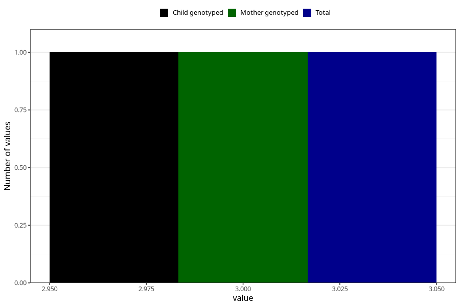

# ever_had_lack_of_energy_before_pregnancy
Variable mapping to `AA1574` in `Skjema1_v12`.
- Number of values:

| Value | Total | Child genotyped | Mother genotyped | Father genotyped |
| ----- | ----- | --------------- | ---------------- | ---------------- |
| Missing | 4944 | 4944 | 4701 | 2888 |
| Non-missing | 70364 | 70364 | 66949 | 47196 |
| More than 1 check box filled in | 12 | 12 | 11 |8 |
| No | 32111 | 32111 | 30605 |21970 |
| Yes | 38240 | 38240 | 36332 |25218 |
| 3 | 1 | 1 | 1 | 0 |

