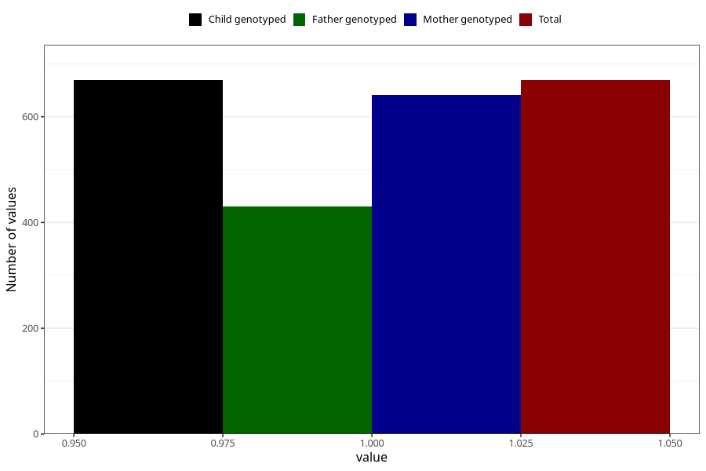

# highest_blood_pressure_during_pregnancy_15w
Variable mapping to `AA555` in `Skjema1_v12`.
- Number of values:

| Value | Total | Child genotyped | Mother genotyped | Father genotyped |
| ----- | ----- | --------------- | ---------------- | ---------------- |
| Missing | 74639 | 74639 | 71009 | 49654 |
| Non-missing | 669 | 669 | 641 | 430 |
| 1 | 669 | 669 | 641 | 430 |

