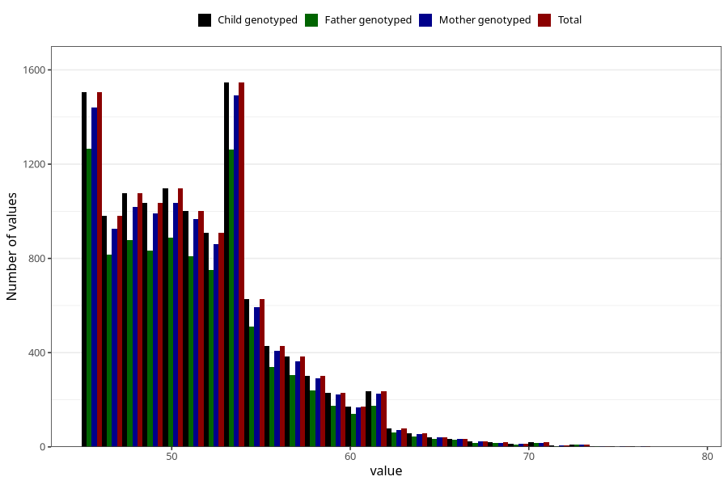

# age_answering_q_45f
Variable mapping to `AGE_YRS_LF` in `MobaForeldre45_Far_v12_standard`.
- Number of values:

| Value | Total | Child genotyped | Mother genotyped | Father genotyped |
| ----- | ----- | --------------- | ---------------- | ---------------- |
| Missing | 63468 | 63468 | 60347 | 40456 |
| Non-missing | 11840 | 11840 | 11303 | 9628 |
| 25th percentile | 48 | 48 | 48 | 48 |
| 50th percentile | 51 | 51 | 51 | 51 |
| 75th percentile | 54 | 54 | 54 | 54 |
| Mean | 51.4825168918919 | 51.4825168918919 | 51.4963284083872 | 51.3994599085999 |
| Standard deviation | 4.68481525359893 | 4.68481525359893 | 4.69054401077896 | 4.64476836764829 |
| N | 11840 | 11840 | 11303 | 9628 |

