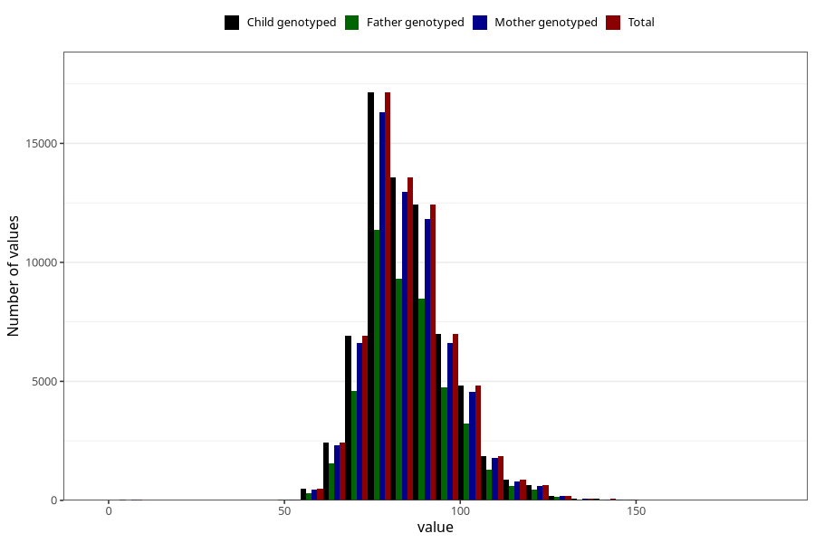

# father_weight_15w
Variable mapping to `AA89` in `Skjema1_v12`.
- Number of values:

| Value | Total | Child genotyped | Mother genotyped | Father genotyped |
| ----- | ----- | --------------- | ---------------- | ---------------- |
| Missing | 6737 | 6737 | 6393 | 3876 |
| Non-missing | 68571 | 68571 | 65257 | 46208 |
| 25th percentile | 77 | 77 | 77 | 77 |
| 50th percentile | 85 | 85 | 85 | 85 |
| 75th percentile | 92 | 92 | 92 | 92 |
| Mean | 85.3640751921366 | 85.3640751921366 | 85.3445147646996 | 85.5037439404432 |
| Standard deviation | 12.2579858002478 | 12.2579858002478 | 12.2298480449458 | 12.1506541283735 |
| N | 68571 | 68571 | 65257 | 46208 |

