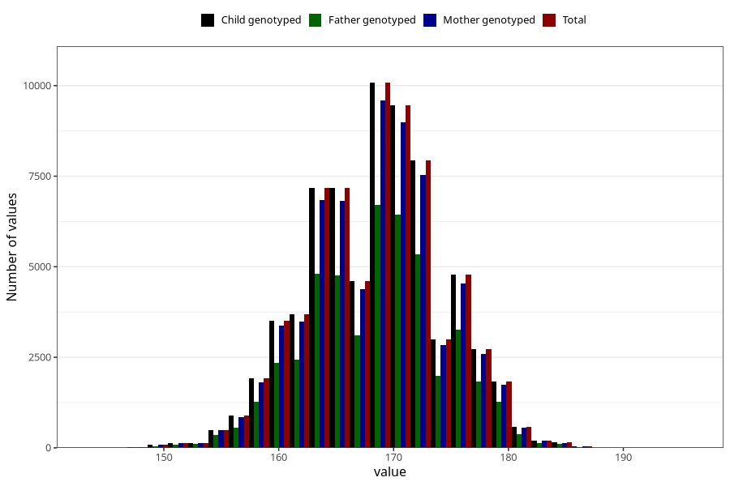

# mother_height_self
Variable mapping to `AA87` in `Skjema1_v12`.
- Number of values:

| Value | Total | Child genotyped | Mother genotyped | Father genotyped |
| ----- | ----- | --------------- | ---------------- | ---------------- |
| Missing | 4747 | 4747 | 4505 | 2734 |
| Non-missing | 70561 | 70561 | 67145 | 47350 |
| 25th percentile | 164 | 164 | 164 | 164 |
| 50th percentile | 168 | 168 | 168 | 168 |
| 75th percentile | 172 | 172 | 172 | 172 |
| Mean | 168.36622213404 | 168.36622213404 | 168.364033062775 | 168.404730728617 |
| Standard deviation | 5.76262472606701 | 5.76262472606701 | 5.76535261503966 | 5.76010185417205 |
| N | 70561 | 70561 | 67145 | 47350 |

