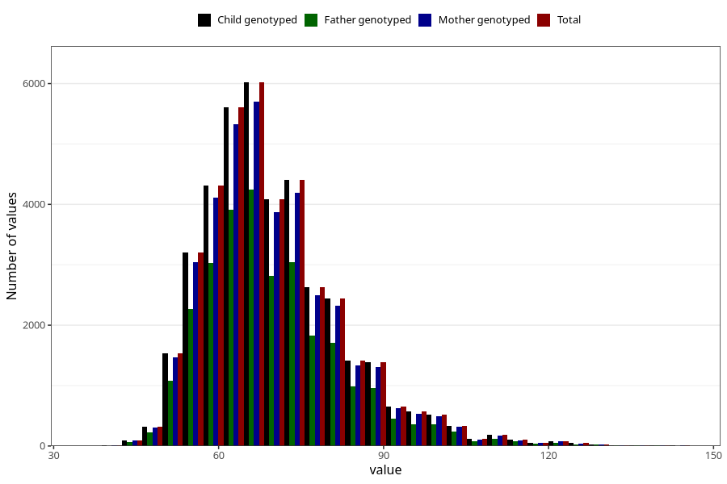

# mother_weight_3y
Variable mapping to `GG501` in `Skjema6_3aar_v12`.
- Number of values:

| Value | Total | Child genotyped | Mother genotyped | Father genotyped |
| ----- | ----- | --------------- | ---------------- | ---------------- |
| Missing | 35112 | 35112 | 33469 | 22074 |
| Non-missing | 40196 | 40196 | 38181 | 28010 |
| 25th percentile | 61 | 61 | 61 | 61 |
| 50th percentile | 68 | 68 | 68 | 68 |
| 75th percentile | 76 | 76 | 76 | 76 |
| Mean | 70.0390163200318 | 70.0390163200318 | 70.0042874728268 | 69.9174259193145 |
| Standard deviation | 12.7768054721057 | 12.7768054721057 | 12.7457992012955 | 12.6736176185538 |
| N | 40196 | 40196 | 38181 | 28010 |

