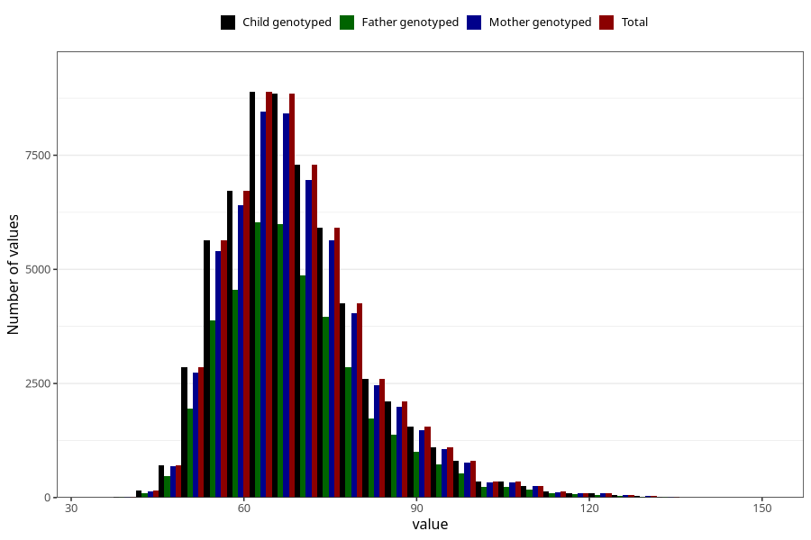

# mother_weight_6m
Variable mapping to `DD673` in `Skjema4_6mnd_v12`.
- Number of values:

| Value | Total | Child genotyped | Mother genotyped | Father genotyped |
| ----- | ----- | --------------- | ---------------- | ---------------- |
| Missing | 14409 | 14409 | 13668 | 9080 |
| Non-missing | 60899 | 60899 | 57982 | 41004 |
| 25th percentile | 60 | 60 | 60 | 60 |
| 50th percentile | 67 | 67 | 67 | 67 |
| 75th percentile | 75 | 75 | 75 | 75 |
| Mean | 69.1691751917109 | 69.1691751917109 | 69.1399537787589 | 69.0662862159789 |
| Standard deviation | 12.7179483144184 | 12.7179483144184 | 12.6881863833201 | 12.6940225028747 |
| N | 60899 | 60899 | 57982 | 41004 |

