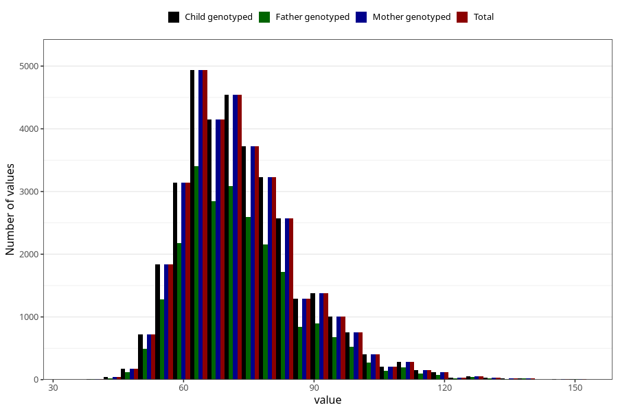

# weight_hm
Variable mapping to `HM260` in `HelseModre`.
- Number of values:

| Value | Total | Child genotyped | Mother genotyped | Father genotyped |
| ----- | ----- | --------------- | ---------------- | ---------------- |
| Missing | 40466 | 40466 | 36808 | 26321 |
| Non-missing | 34842 | 34842 | 34842 | 23763 |
| 25th percentile | 64 | 64 | 64 | 64 |
| 50th percentile | 71 | 71 | 71 | 71 |
| 75th percentile | 80 | 80 | 80 | 80 |
| Mean | 73.6215487055852 | 73.6215487055852 | 73.6215487055852 | 73.4889534149729 |
| Standard deviation | 13.6564868762128 | 13.6564868762128 | 13.6564868762128 | 13.6338916007044 |
| N | 34842 | 34842 | 34842 | 23763 |

