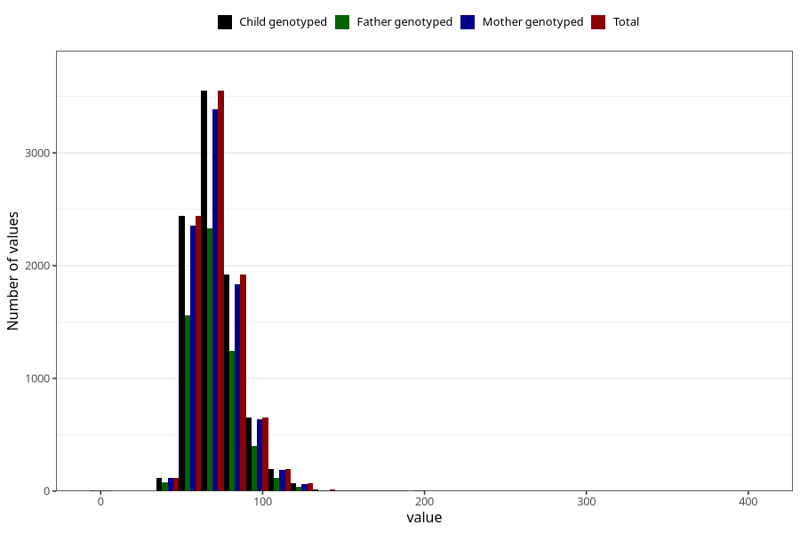

# weight_ung
Variable mapping to `UH52` in `UngHelse_standard`.
- Number of values:

| Value | Total | Child genotyped | Mother genotyped | Father genotyped |
| ----- | ----- | --------------- | ---------------- | ---------------- |
| Missing | 66308 | 66308 | 63038 | 44285 |
| Non-missing | 9000 | 9000 | 8612 | 5799 |
| 25th percentile | 61 | 61 | 61 | 61 |
| 50th percentile | 70 | 70 | 70 | 70 |
| 75th percentile | 80 | 80 | 80 | 80 |
| Mean | 71.5223333333333 | 71.5223333333333 | 71.5340222944728 | 71.2816002759096 |
| Standard deviation | 15.3854123619079 | 15.3854123619079 | 15.3830547415561 | 14.8073005004734 |
| N | 9000 | 9000 | 8612 | 5799 |

