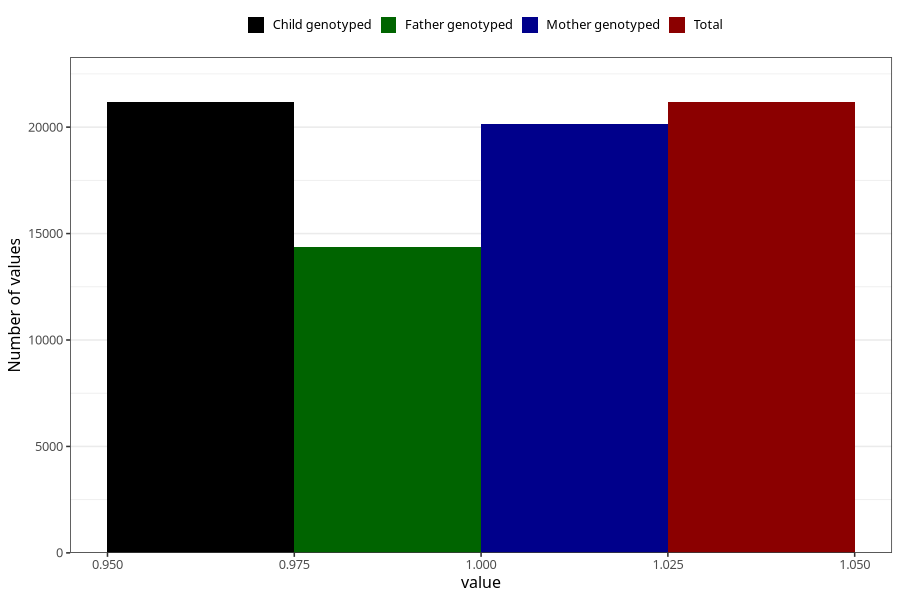

# back_pain_after_29w
Variable mapping to `CC356` in `Skjema3_v12`.
- Number of values:

| Value | Total | Child genotyped | Mother genotyped | Father genotyped |
| ----- | ----- | --------------- | ---------------- | ---------------- |
| Missing | 54137 | 54137 | 51493 | 35703 |
| Non-missing | 21171 | 21171 | 20157 | 14381 |
| 1 | 21171 | 21171 | 20157 | 14381 |

