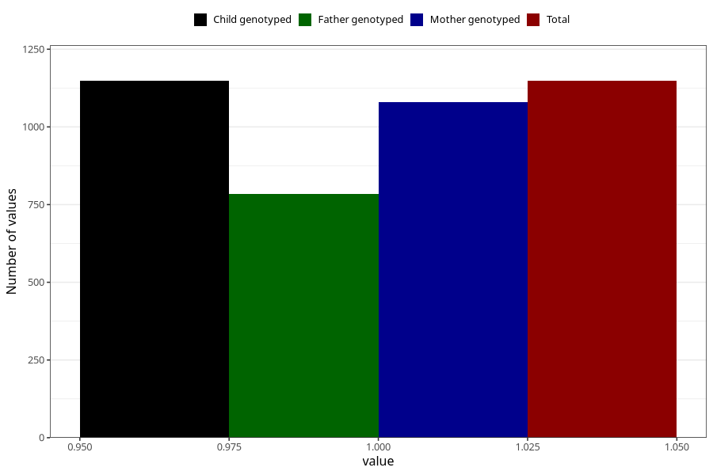

# fever_over385_13w_15w
Variable mapping to `AA339` in `Skjema1_v12`.
- Number of values:

| Value | Total | Child genotyped | Mother genotyped | Father genotyped |
| ----- | ----- | --------------- | ---------------- | ---------------- |
| Missing | 74160 | 74160 | 70571 | 49300 |
| Non-missing | 1148 | 1148 | 1079 | 784 |
| 1 | 1148 | 1148 | 1079 | 784 |

