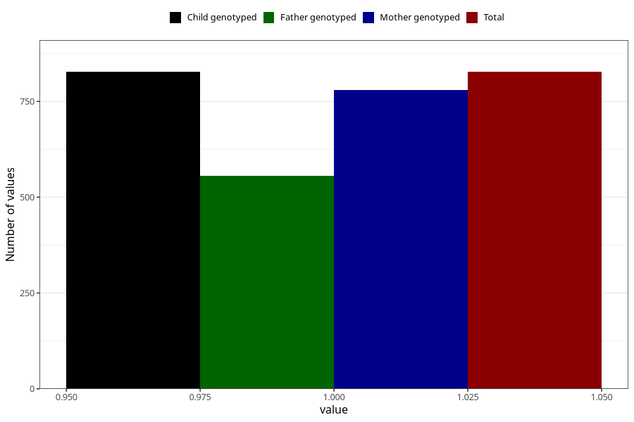

# fever_over385_5w_8w
Variable mapping to `AA337` in `Skjema1_v12`.
- Number of values:

| Value | Total | Child genotyped | Mother genotyped | Father genotyped |
| ----- | ----- | --------------- | ---------------- | ---------------- |
| Missing | 74481 | 74481 | 70870 | 49529 |
| Non-missing | 827 | 827 | 780 | 555 |
| 1 | 827 | 827 | 780 | 555 |

