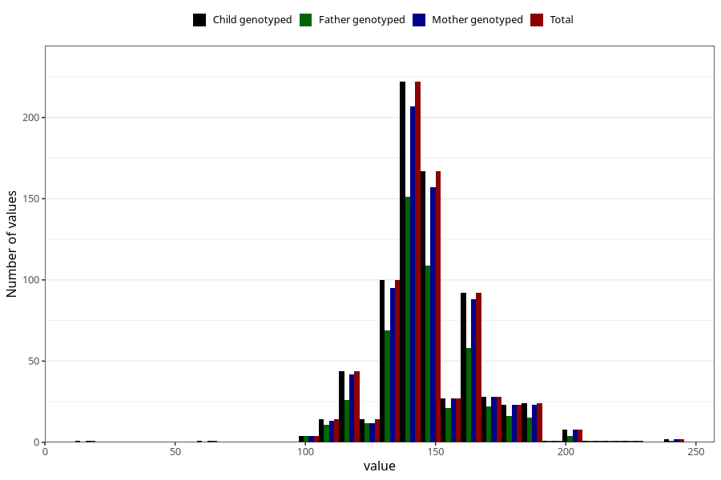

# highest_blood_pressure_before_pregnancy_systolic
Variable mapping to `CC118` in `Skjema3_v12`.
- Number of values:

| Value | Total | Child genotyped | Mother genotyped | Father genotyped |
| ----- | ----- | --------------- | ---------------- | ---------------- |
| Missing | 74533 | 74533 | 70915 | 49561 |
| Non-missing | 775 | 775 | 735 | 523 |
| 25th percentile | 140 | 140 | 140 | 140 |
| 50th percentile | 140 | 140 | 140 | 140 |
| 75th percentile | 155 | 155 | 155 | 155 |
| Mean | 146.129032258065 | 146.129032258065 | 146.397278911565 | 146.225621414914 |
| Standard deviation | 19.286869345895 | 19.286869345895 | 19.5289903470516 | 18.600322200534 |
| N | 775 | 775 | 735 | 523 |

