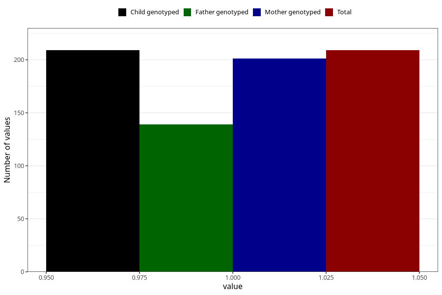

# hospitalized_threatening_preterm_labour_after_29w
Variable mapping to `CC172` in `Skjema3_v12`.
- Number of values:

| Value | Total | Child genotyped | Mother genotyped | Father genotyped |
| ----- | ----- | --------------- | ---------------- | ---------------- |
| Missing | 75099 | 75099 | 71449 | 49945 |
| Non-missing | 209 | 209 | 201 | 139 |
| 1 | 209 | 209 | 201 | 139 |

