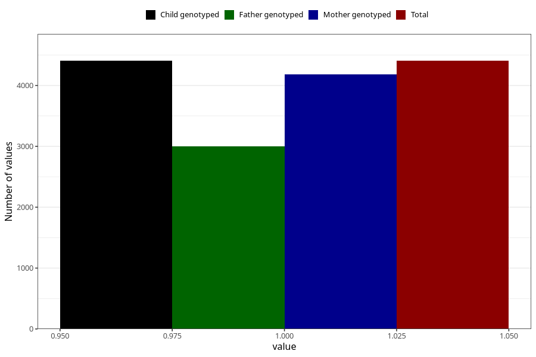

# nausea_25w_28w
Variable mapping to `CC379` in `Skjema3_v12`.
- Number of values:

| Value | Total | Child genotyped | Mother genotyped | Father genotyped |
| ----- | ----- | --------------- | ---------------- | ---------------- |
| Missing | 70903 | 70903 | 67465 | 47085 |
| Non-missing | 4405 | 4405 | 4185 | 2999 |
| 1 | 4405 | 4405 | 4185 | 2999 |

