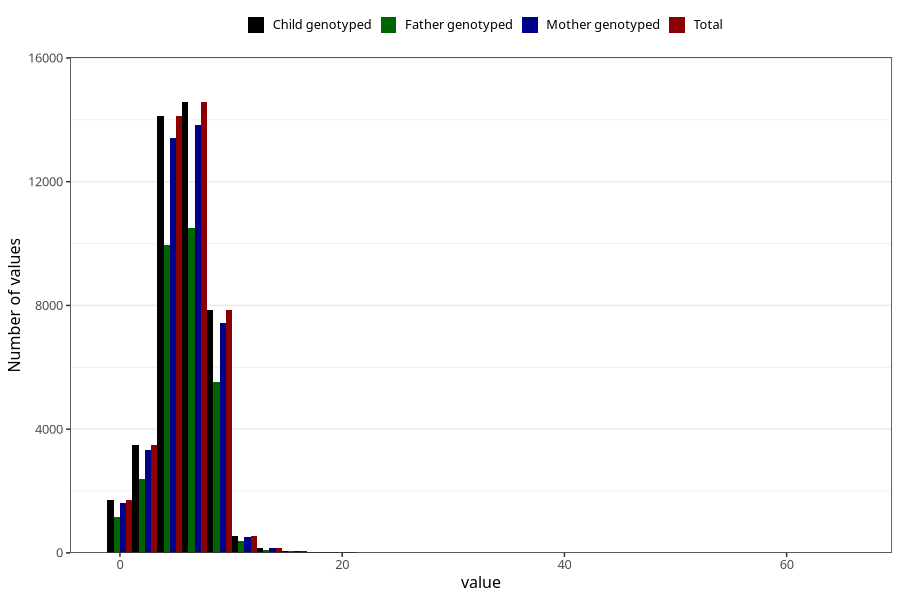

# nausea_week_most_bothered_from_q2
Variable mapping to `BB853` in `Skjema2CDW_v12`.
- Number of values:

| Value | Total | Child genotyped | Mother genotyped | Father genotyped |
| ----- | ----- | --------------- | ---------------- | ---------------- |
| Missing | 32680 | 32680 | 31200 | 19949 |
| Non-missing | 42628 | 42628 | 40450 | 30135 |
| 25th percentile | 4 | 4 | 4 | 4 |
| 50th percentile | 6 | 6 | 6 | 6 |
| 75th percentile | 7 | 7 | 7 | 7 |
| Mean | 5.735385192831 | 5.735385192831 | 5.72983930778739 | 5.75075493612079 |
| Standard deviation | 2.36116177381352 | 2.36116177381352 | 2.36196301645368 | 2.3337459638616 |
| N | 42628 | 42628 | 40450 | 30135 |

