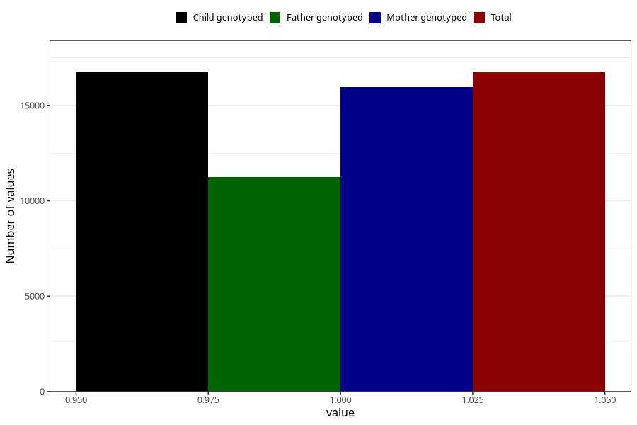

# unusual_tiredness_before_4w
Variable mapping to `AA286` in `Skjema1_v12`.
- Number of values:

| Value | Total | Child genotyped | Mother genotyped | Father genotyped |
| ----- | ----- | --------------- | ---------------- | ---------------- |
| Missing | 58573 | 58573 | 55700 | 38854 |
| Non-missing | 16735 | 16735 | 15950 | 11230 |
| 1 | 16735 | 16735 | 15950 | 11230 |

