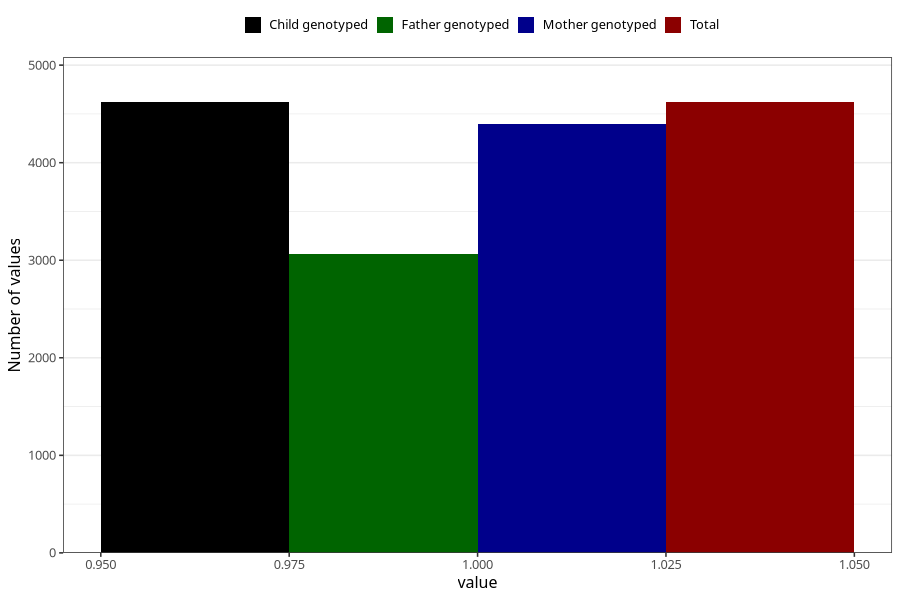

# vaginal_thrush_5w_8w
Variable mapping to `AA237` in `Skjema1_v12`.
- Number of values:

| Value | Total | Child genotyped | Mother genotyped | Father genotyped |
| ----- | ----- | --------------- | ---------------- | ---------------- |
| Missing | 70688 | 70688 | 67256 | 47020 |
| Non-missing | 4620 | 4620 | 4394 | 3064 |
| 1 | 4620 | 4620 | 4394 | 3064 |

