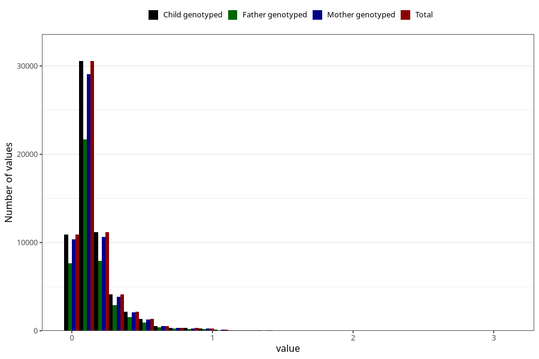

# food_epa_g_day
Variable mapping to `f_epa` in `Skjema2_beregning_CDW_foody_fatty_acid_and_iodine_v12`.
- Number of values:

| Value | Total | Child genotyped | Mother genotyped | Father genotyped |
| ----- | ----- | --------------- | ---------------- | ---------------- |
| Missing | 13178 | 13178 | 12654 | 6217 |
| Non-missing | 62130 | 62130 | 58996 | 43867 |
| 25th percentile | 0.0683 | 0.0683 | 0.0682 | 0.0686 |
| 50th percentile | 0.1158 | 0.1158 | 0.1157 | 0.1159 |
| 75th percentile | 0.193175 | 0.193175 | 0.1928 | 0.1917 |
| Mean | 0.164681875100596 | 0.164681875100596 | 0.164319625059326 | 0.163457669774546 |
| Standard deviation | 0.173080340384597 | 0.173080340384597 | 0.172378760720463 | 0.169965941015674 |
| N | 62130 | 62130 | 58996 | 43867 |

