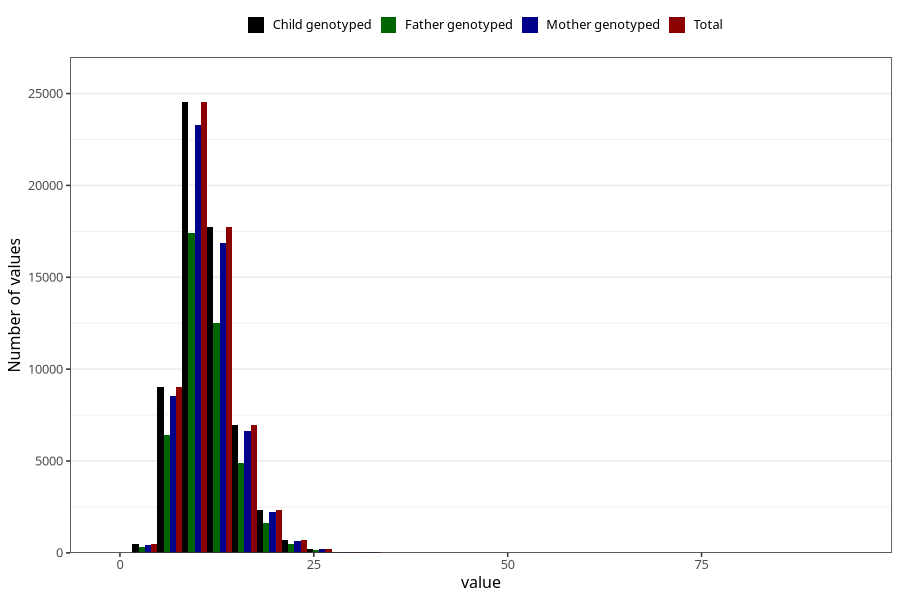

# iron
Variable mapping to `JERN` in `Skjema2_beregning_CDW_v12`.
- Number of values:

| Value | Total | Child genotyped | Mother genotyped | Father genotyped |
| ----- | ----- | --------------- | ---------------- | ---------------- |
| Missing | 13178 | 13178 | 12654 | 6217 |
| Non-missing | 62130 | 62130 | 58996 | 43867 |
| 25th percentile | 8.93 | 8.93 | 8.93 | 8.92 |
| 50th percentile | 10.86 | 10.86 | 10.86 | 10.85 |
| 75th percentile | 13.24 | 13.24 | 13.23 | 13.2 |
| Mean | 11.3775243843554 | 11.3775243843554 | 11.3722304902027 | 11.3413891991702 |
| Standard deviation | 3.67726754110189 | 3.67726754110189 | 3.66600707145386 | 3.61388976992769 |
| N | 62130 | 62130 | 58996 | 43867 |

