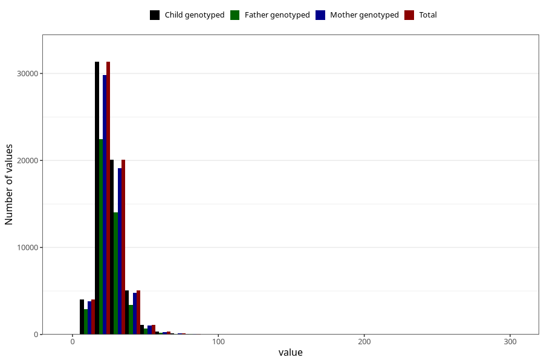

# monounsaturated_fatty_acids
Variable mapping to `ENUMETTET` in `Skjema2_beregning_CDW_v12`.
- Number of values:

| Value | Total | Child genotyped | Mother genotyped | Father genotyped |
| ----- | ----- | --------------- | ---------------- | ---------------- |
| Missing | 13178 | 13178 | 12654 | 6217 |
| Non-missing | 62130 | 62130 | 58996 | 43867 |
| 25th percentile | 20.01 | 20.01 | 20.01 | 19.89 |
| 50th percentile | 24.49 | 24.49 | 24.48 | 24.32 |
| 75th percentile | 30.08 | 30.08 | 30.05 | 29.87 |
| Mean | 25.9567975213263 | 25.9567975213263 | 25.9390850227134 | 25.7469446280803 |
| Standard deviation | 9.21607047700622 | 9.21607047700622 | 9.1913740936153 | 9.0505393112447 |
| N | 62130 | 62130 | 58996 | 43867 |

