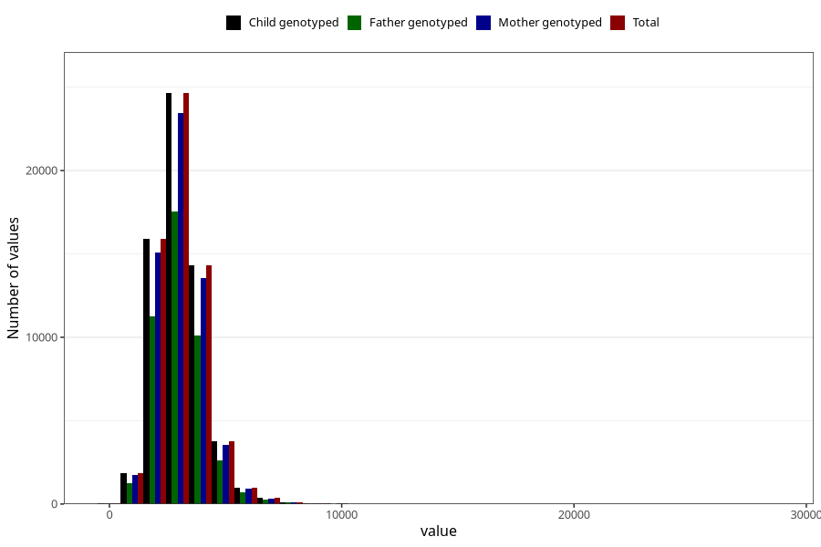

# water_g
Variable mapping to `VANN_G` in `Skjema2_beregning_CDW_v12`.
- Number of values:

| Value | Total | Child genotyped | Mother genotyped | Father genotyped |
| ----- | ----- | --------------- | ---------------- | ---------------- |
| Missing | 13178 | 13178 | 12654 | 6217 |
| Non-missing | 62130 | 62130 | 58996 | 43867 |
| 25th percentile | 2352.545 | 2352.545 | 2353.8775 | 2354.405 |
| 50th percentile | 2960 | 2960 | 2959.635 | 2957.18 |
| 75th percentile | 3618.55 | 3618.55 | 3615.83 | 3606.925 |
| Mean | 3064.81981973282 | 3064.81981973282 | 3063.39109770154 | 3056.06044338569 |
| Standard deviation | 1068.36441071179 | 1068.36441071179 | 1066.61495513488 | 1048.6323469556 |
| N | 62130 | 62130 | 58996 | 43867 |

