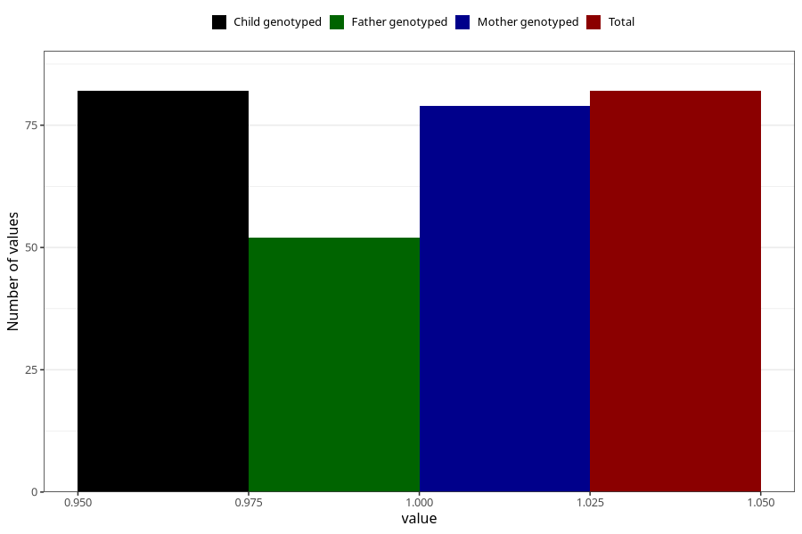

# treated_for_infertility_medication_endometriosis
Variable mapping to `AA73` in `Skjema1_v12`.
- Number of values:

| Value | Total | Child genotyped | Mother genotyped | Father genotyped |
| ----- | ----- | --------------- | ---------------- | ---------------- |
| Missing | 75226 | 75226 | 71571 | 50032 |
| Non-missing | 82 | 82 | 79 | 52 |
| 1 | 82 | 82 | 79 | 52 |

