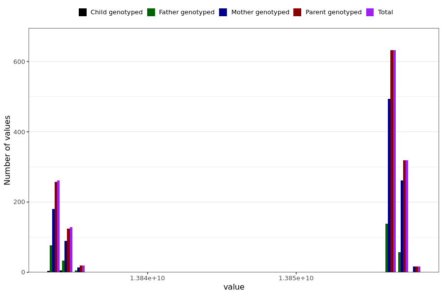

# altered_smell_taste_last_reported
- Number of values:

| Value | Total | Child genotyped | Mother genotyped | Father genotyped | Parents genotyped |
| ----- | ----- | --------------- | ---------------- | ---------------- |---------------- |
| Missing | 229612 | 83461 | 86588 | 59563 | 146151 |
| Non-missing | 1377 | 9 | 1057 | 311 | 1368 |

| Value | Total | Child genotyped | Mother genotyped | Father genotyped | Parents genotyped |
| ----- | ----- | --------------- | ---------------- | ---------------- |---------------- |
| 25th percentile | 13834886400 | 13834022400 | 13834886400 | 13834108800 | 13834886400 |
| 50th percentile | 13856572800 | 13834108800 | 13856572800 | 13856572800 | 13856572800 |
| 75th percentile | 13856659200 | 13834886400 | 13856745600 | 13856572800 | 13856659200 |

