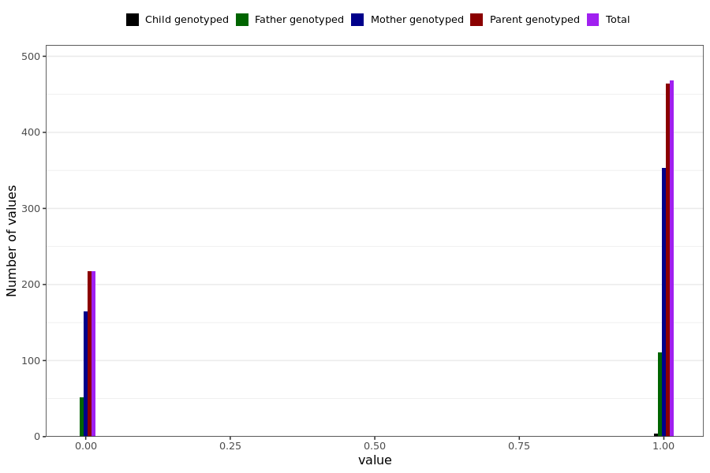

# altered_smell_taste_short
- Number of values:

| Value | Total | Child genotyped | Mother genotyped | Father genotyped | Parents genotyped |
| ----- | ----- | --------------- | ---------------- | ---------------- |---------------- |
| Missing | 230304 | 83466 | 87127 | 59711 | 146838 |
| Non-missing | 685 | 4 | 518 | 163 | 681 |

| Value | Total | Child genotyped | Mother genotyped | Father genotyped | Parents genotyped |
| ----- | ----- | --------------- | ---------------- | ---------------- |---------------- |
| 0 | 217 | 0 | 165 | 52 | 217 |
| 1 | 468 | 4 | 353 | 111 | 464 |

