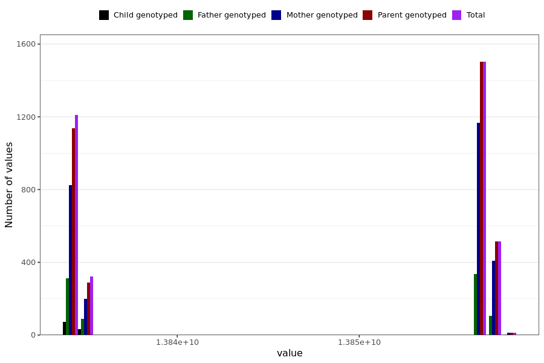

# anxiety_last_reported
- Number of values:

| Value | Total | Child genotyped | Mother genotyped | Father genotyped | Parents genotyped |
| ----- | ----- | --------------- | ---------------- | ---------------- |---------------- |
| Missing | 227426 | 83364 | 85036 | 59026 | 144062 |
| Non-missing | 3563 | 106 | 2609 | 848 | 3457 |

| Value | Total | Child genotyped | Mother genotyped | Father genotyped | Parents genotyped |
| ----- | ----- | --------------- | ---------------- | ---------------- |---------------- |
| 25th percentile | 13834022400 | 13834022400 | 13834022400 | 13834022400 | 13834022400 |
| 50th percentile | 13856572800 | 13834022400 | 13856572800 | 13856572800 | 13856572800 |
| 75th percentile | 13856572800 | 13834886400 | 13856572800 | 13856572800 | 13856572800 |

