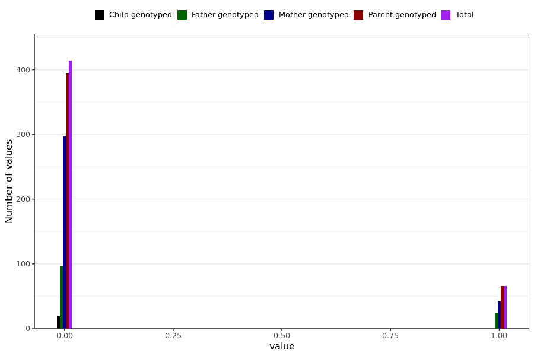

# anxiety_long
- Number of values:

| Value | Total | Child genotyped | Mother genotyped | Father genotyped | Parents genotyped |
| ----- | ----- | --------------- | ---------------- | ---------------- |---------------- |
| Missing | 230509 | 83451 | 87305 | 59753 | 147058 |
| Non-missing | 480 | 19 | 340 | 121 | 461 |

| Value | Total | Child genotyped | Mother genotyped | Father genotyped | Parents genotyped |
| ----- | ----- | --------------- | ---------------- | ---------------- |---------------- |
| 0 | 414 | 19 | 298 | 97 | 395 |
| 1 | 66 | 0 | 42 | 24 | 66 |

