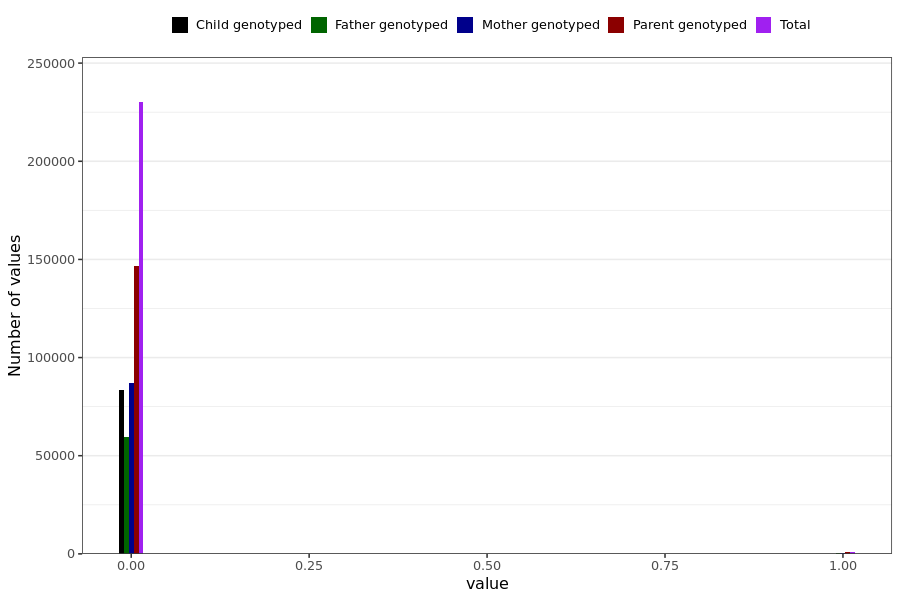

# anySymptomLong
- Number of values:

| Value | Total | Child genotyped | Mother genotyped | Father genotyped | Parents genotyped |
| ----- | ----- | --------------- | ---------------- | ---------------- |---------------- |
| Missing | 0 | 0 | 0 | 0 | 0 |
| Non-missing | 230989 | 83470 | 87645 | 59874 | 147519 |

| Value | Total | Child genotyped | Mother genotyped | Father genotyped | Parents genotyped |
| ----- | ----- | --------------- | ---------------- | ---------------- |---------------- |
| 0 | 230044 | 83467 | 86978 | 59599 | 146577 |
| 1 | 945 | 3 | 667 | 275 | 942 |

