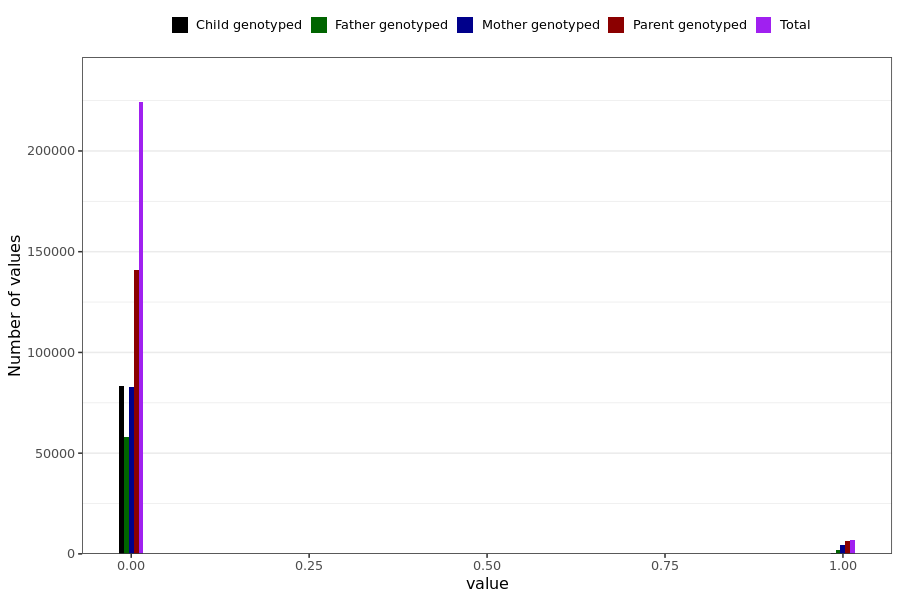

# anySymptomShort
- Number of values:

| Value | Total | Child genotyped | Mother genotyped | Father genotyped | Parents genotyped |
| ----- | ----- | --------------- | ---------------- | ---------------- |---------------- |
| Missing | 0 | 0 | 0 | 0 | 0 |
| Non-missing | 230989 | 83470 | 87645 | 59874 | 147519 |

| Value | Total | Child genotyped | Mother genotyped | Father genotyped | Parents genotyped |
| ----- | ----- | --------------- | ---------------- | ---------------- |---------------- |
| 0 | 224176 | 83180 | 83053 | 57943 | 140996 |
| 1 | 6813 | 290 | 4592 | 1931 | 6523 |

