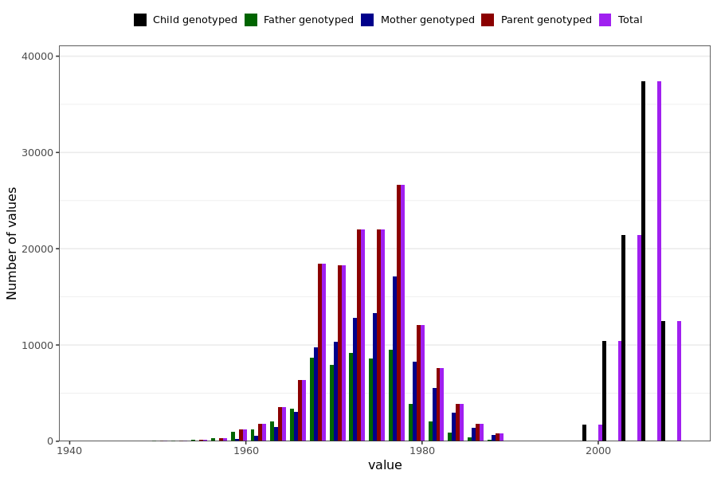

# birth_year
- Number of values:

| Value | Total | Child genotyped | Mother genotyped | Father genotyped | Parents genotyped |
| ----- | ----- | --------------- | ---------------- | ---------------- |---------------- |
| Missing | 401 | 66 | 177 | 158 | 335 |
| Non-missing | 230588 | 83404 | 87468 | 59716 | 147184 |

| Value | Total | Child genotyped | Mother genotyped | Father genotyped | Parents genotyped |
| ----- | ----- | --------------- | ---------------- | ---------------- |---------------- |
| 25th percentile | 1972 | 2003 | 1971 | 1969 | 1970 |
| 50th percentile | 1978 | 2005 | 1974 | 1973 | 1974 |
| 75th percentile | 2004 | 2007 | 1978 | 1976 | 1977 |

