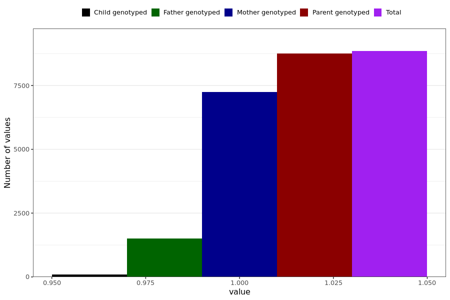

# brain_fog
- Number of values:

| Value | Total | Child genotyped | Mother genotyped | Father genotyped | Parents genotyped |
| ----- | ----- | --------------- | ---------------- | ---------------- |---------------- |
| Missing | 222143 | 83371 | 80394 | 58378 | 138772 |
| Non-missing | 8846 | 99 | 7251 | 1496 | 8747 |

| Value | Total | Child genotyped | Mother genotyped | Father genotyped | Parents genotyped |
| ----- | ----- | --------------- | ---------------- | ---------------- |---------------- |
| 1 | 8846 | 99 | 7251 | 1496 | 8747 |

