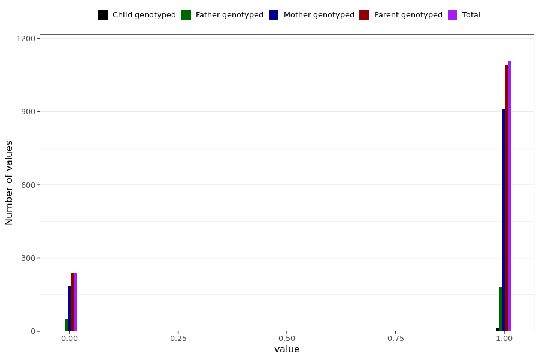

# brain_fog_short
- Number of values:

| Value | Total | Child genotyped | Mother genotyped | Father genotyped | Parents genotyped |
| ----- | ----- | --------------- | ---------------- | ---------------- |---------------- |
| Missing | 229644 | 83457 | 86547 | 59640 | 146187 |
| Non-missing | 1345 | 13 | 1098 | 234 | 1332 |

| Value | Total | Child genotyped | Mother genotyped | Father genotyped | Parents genotyped |
| ----- | ----- | --------------- | ---------------- | ---------------- |---------------- |
| 0 | 238 | 0 | 186 | 52 | 238 |
| 1 | 1107 | 13 | 912 | 182 | 1094 |

