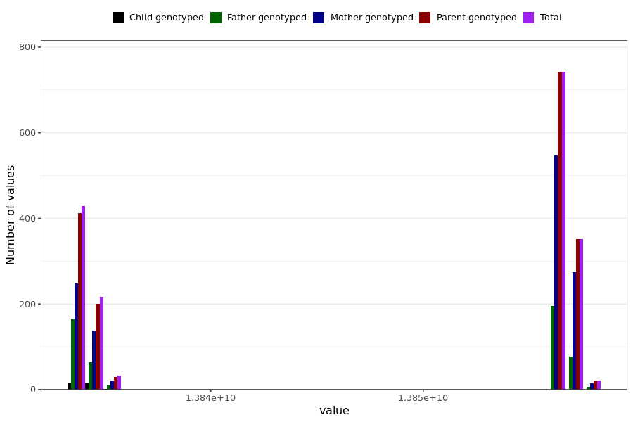

# chest_pain_last_reported
- Number of values:

| Value | Total | Child genotyped | Mother genotyped | Father genotyped | Parents genotyped |
| ----- | ----- | --------------- | ---------------- | ---------------- |---------------- |
| Missing | 229197 | 83435 | 86403 | 59359 | 145762 |
| Non-missing | 1792 | 35 | 1242 | 515 | 1757 |

| Value | Total | Child genotyped | Mother genotyped | Father genotyped | Parents genotyped |
| ----- | ----- | --------------- | ---------------- | ---------------- |---------------- |
| 25th percentile | 13834108800 | 13834022400 | 13834454400 | 13834022400 | 13834108800 |
| 50th percentile | 13856572800 | 13834108800 | 13856572800 | 13856572800 | 13856572800 |
| 75th percentile | 13856572800 | 13834886400 | 13856659200 | 13856572800 | 13856572800 |

