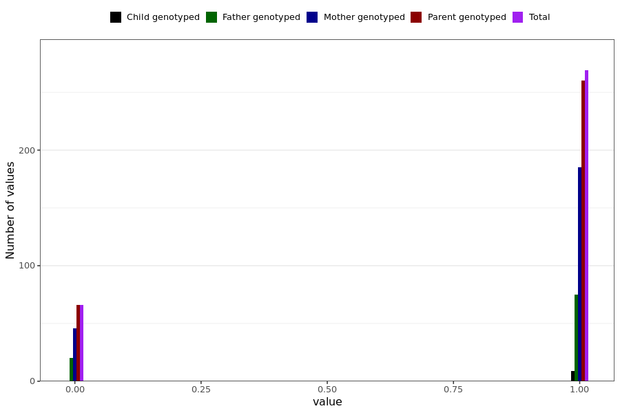

# chest_pain_short
- Number of values:

| Value | Total | Child genotyped | Mother genotyped | Father genotyped | Parents genotyped |
| ----- | ----- | --------------- | ---------------- | ---------------- |---------------- |
| Missing | 230654 | 83461 | 87414 | 59779 | 147193 |
| Non-missing | 335 | 9 | 231 | 95 | 326 |

| Value | Total | Child genotyped | Mother genotyped | Father genotyped | Parents genotyped |
| ----- | ----- | --------------- | ---------------- | ---------------- |---------------- |
| 0 | 66 | 0 | 46 | 20 | 66 |
| 1 | 269 | 9 | 185 | 75 | 260 |

