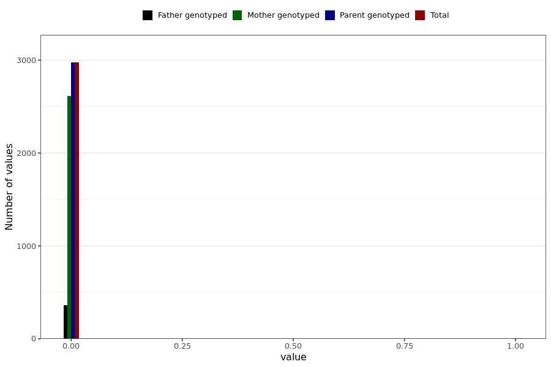

# corona_vaccine_blood_clot_after_asz
- Number of values:

| Value | Total | Child genotyped | Mother genotyped | Father genotyped | Parents genotyped |
| ----- | ----- | --------------- | ---------------- | ---------------- |---------------- |
| Missing | 228008 | 83470 | 85025 | 59513 | 144538 |
| Non-missing | 2981 | 0 | 2620 | 361 | 2981 |

| Value | Total | Child genotyped | Mother genotyped | Father genotyped | Parents genotyped |
| ----- | ----- | --------------- | ---------------- | ---------------- |---------------- |
| 0 | 2974 | 0 | 2613 | 361 | 2974 |
| 1 | 7 | 0 | 7 | 0 | 7 |

