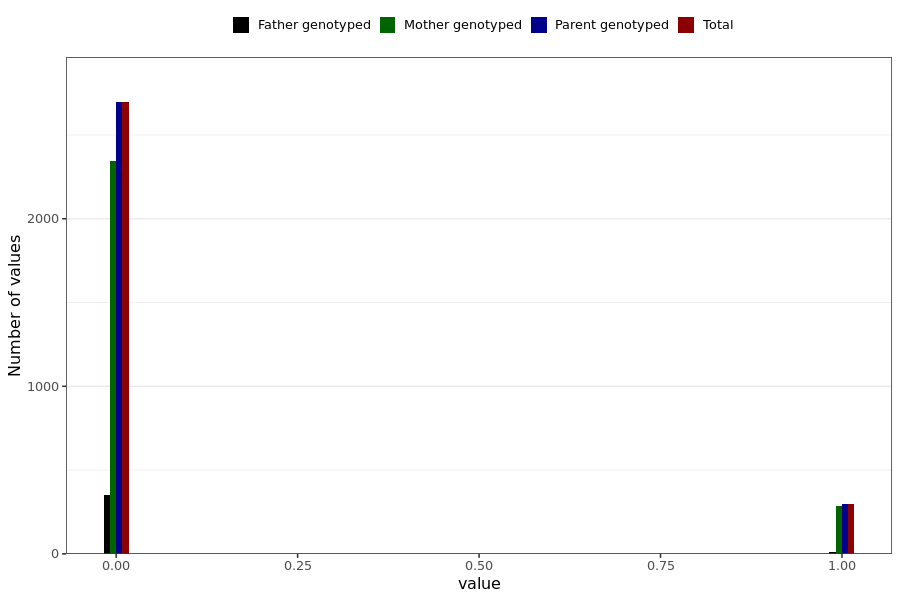

# corona_vaccine_ecchymosis_after_asz
- Number of values:

| Value | Total | Child genotyped | Mother genotyped | Father genotyped | Parents genotyped |
| ----- | ----- | --------------- | ---------------- | ---------------- |---------------- |
| Missing | 227999 | 83470 | 85017 | 59512 | 144529 |
| Non-missing | 2990 | 0 | 2628 | 362 | 2990 |

| Value | Total | Child genotyped | Mother genotyped | Father genotyped | Parents genotyped |
| ----- | ----- | --------------- | ---------------- | ---------------- |---------------- |
| 0 | 2695 | 0 | 2345 | 350 | 2695 |
| 1 | 295 | 0 | 283 | 12 | 295 |

