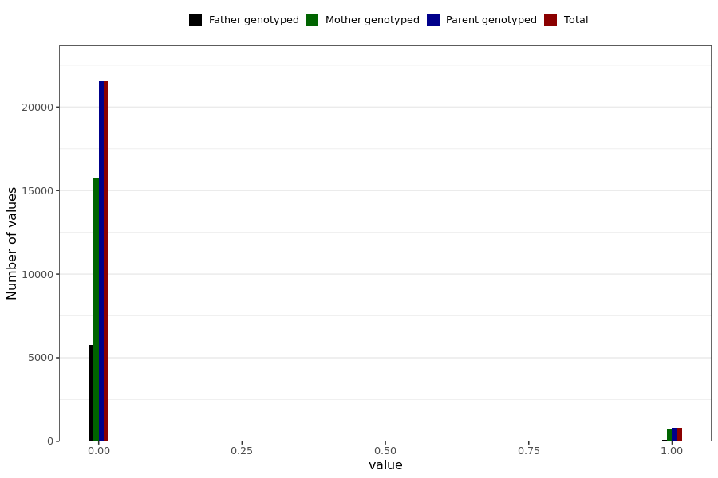

# corona_vaccine_ecchymosis_after_bnt
- Number of values:

| Value | Total | Child genotyped | Mother genotyped | Father genotyped | Parents genotyped |
| ----- | ----- | --------------- | ---------------- | ---------------- |---------------- |
| Missing | 208654 | 83470 | 71159 | 54025 | 125184 |
| Non-missing | 22335 | 0 | 16486 | 5849 | 22335 |

| Value | Total | Child genotyped | Mother genotyped | Father genotyped | Parents genotyped |
| ----- | ----- | --------------- | ---------------- | ---------------- |---------------- |
| 0 | 21529 | 0 | 15785 | 5744 | 21529 |
| 1 | 806 | 0 | 701 | 105 | 806 |

