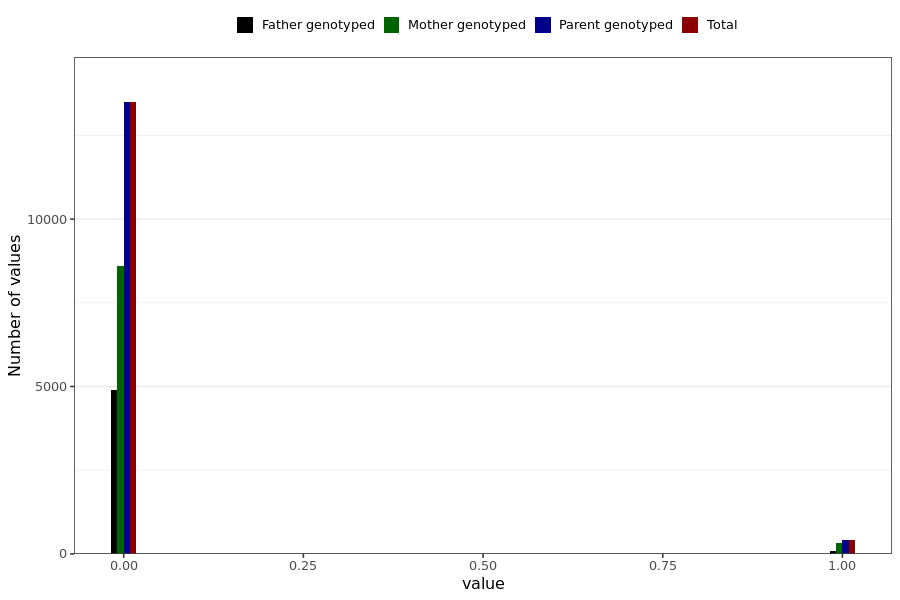

# corona_vaccine_ecchymosis_after_mod
- Number of values:

| Value | Total | Child genotyped | Mother genotyped | Father genotyped | Parents genotyped |
| ----- | ----- | --------------- | ---------------- | ---------------- |---------------- |
| Missing | 217086 | 83470 | 78716 | 54900 | 133616 |
| Non-missing | 13903 | 0 | 8929 | 4974 | 13903 |

| Value | Total | Child genotyped | Mother genotyped | Father genotyped | Parents genotyped |
| ----- | ----- | --------------- | ---------------- | ---------------- |---------------- |
| 0 | 13489 | 0 | 8593 | 4896 | 13489 |
| 1 | 414 | 0 | 336 | 78 | 414 |

