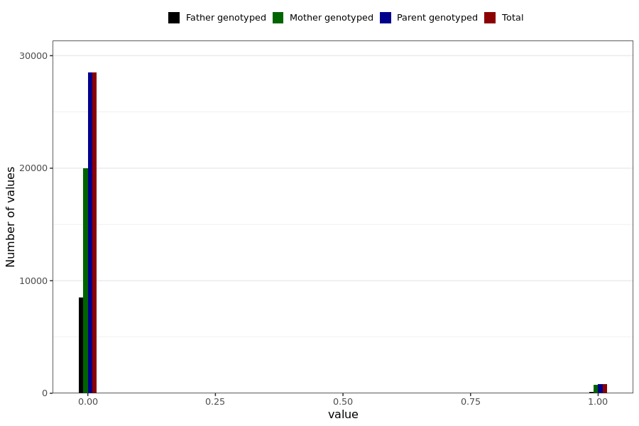

# corona_vaccine_ecchymosis_last_dose
- Number of values:

| Value | Total | Child genotyped | Mother genotyped | Father genotyped | Parents genotyped |
| ----- | ----- | --------------- | ---------------- | ---------------- |---------------- |
| Missing | 201658 | 83470 | 66918 | 51270 | 118188 |
| Non-missing | 29331 | 0 | 20727 | 8604 | 29331 |

| Value | Total | Child genotyped | Mother genotyped | Father genotyped | Parents genotyped |
| ----- | ----- | --------------- | ---------------- | ---------------- |---------------- |
| 0 | 28493 | 0 | 20007 | 8486 | 28493 |
| 1 | 838 | 0 | 720 | 118 | 838 |

