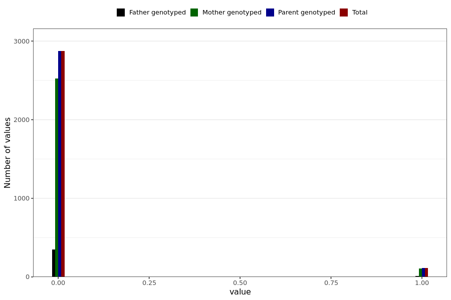

# corona_vaccine_gum_bleeding_after_asz
- Number of values:

| Value | Total | Child genotyped | Mother genotyped | Father genotyped | Parents genotyped |
| ----- | ----- | --------------- | ---------------- | ---------------- |---------------- |
| Missing | 228002 | 83470 | 85019 | 59513 | 144532 |
| Non-missing | 2987 | 0 | 2626 | 361 | 2987 |

| Value | Total | Child genotyped | Mother genotyped | Father genotyped | Parents genotyped |
| ----- | ----- | --------------- | ---------------- | ---------------- |---------------- |
| 0 | 2872 | 0 | 2521 | 351 | 2872 |
| 1 | 115 | 0 | 105 | 10 | 115 |

