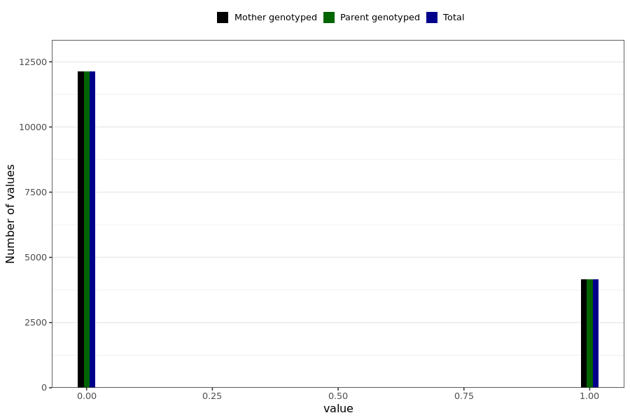

# corona_vaccine_last_menstruation_normal
- Number of values:

| Value | Total | Child genotyped | Mother genotyped | Father genotyped | Parents genotyped |
| ----- | ----- | --------------- | ---------------- | ---------------- |---------------- |
| Missing | 214717 | 83470 | 71373 | 59874 | 131247 |
| Non-missing | 16272 | 0 | 16272 | 0 | 16272 |

| Value | Total | Child genotyped | Mother genotyped | Father genotyped | Parents genotyped |
| ----- | ----- | --------------- | ---------------- | ---------------- |---------------- |
| 0 | 12125 | 0 | 12125 | 0 | 12125 |
| 1 | 4147 | 0 | 4147 | 0 | 4147 |

