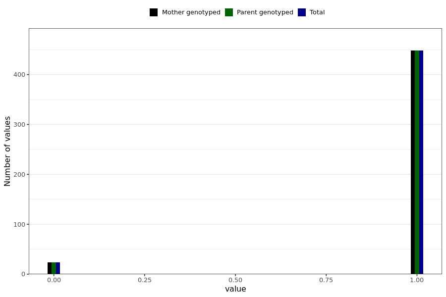

# corona_vaccine_last_menstruation_unexpected_bleeding
- Number of values:

| Value | Total | Child genotyped | Mother genotyped | Father genotyped | Parents genotyped |
| ----- | ----- | --------------- | ---------------- | ---------------- |---------------- |
| Missing | 230517 | 83470 | 87173 | 59874 | 147047 |
| Non-missing | 472 | 0 | 472 | 0 | 472 |

| Value | Total | Child genotyped | Mother genotyped | Father genotyped | Parents genotyped |
| ----- | ----- | --------------- | ---------------- | ---------------- |---------------- |
| 0 | 24 | 0 | 24 | 0 | 24 |
| 1 | 448 | 0 | 448 | 0 | 448 |

