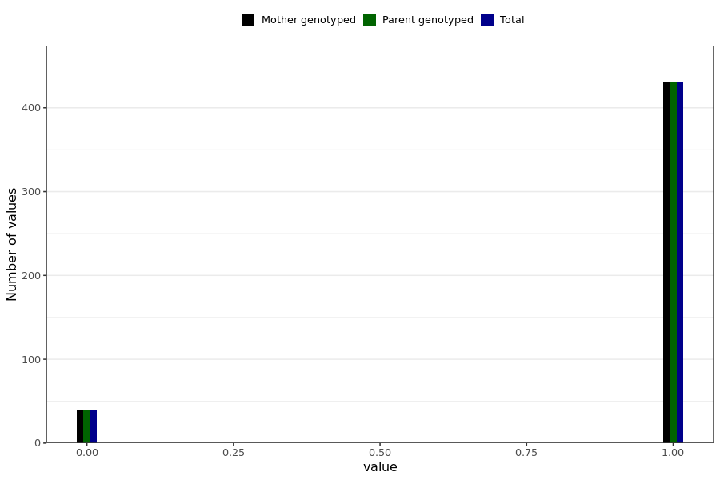

# corona_vaccine_last_menstruation_unusually_short_interval
- Number of values:

| Value | Total | Child genotyped | Mother genotyped | Father genotyped | Parents genotyped |
| ----- | ----- | --------------- | ---------------- | ---------------- |---------------- |
| Missing | 230518 | 83470 | 87174 | 59874 | 147048 |
| Non-missing | 471 | 0 | 471 | 0 | 471 |

| Value | Total | Child genotyped | Mother genotyped | Father genotyped | Parents genotyped |
| ----- | ----- | --------------- | ---------------- | ---------------- |---------------- |
| 0 | 40 | 0 | 40 | 0 | 40 |
| 1 | 431 | 0 | 431 | 0 | 431 |

