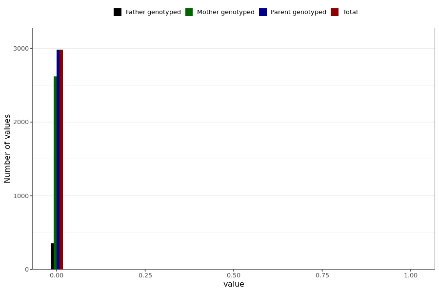

# corona_vaccine_myokardite_after_asz
- Number of values:

| Value | Total | Child genotyped | Mother genotyped | Father genotyped | Parents genotyped |
| ----- | ----- | --------------- | ---------------- | ---------------- |---------------- |
| Missing | 228008 | 83470 | 85022 | 59516 | 144538 |
| Non-missing | 2981 | 0 | 2623 | 358 | 2981 |

| Value | Total | Child genotyped | Mother genotyped | Father genotyped | Parents genotyped |
| ----- | ----- | --------------- | ---------------- | ---------------- |---------------- |
| 0 | 2980 | 0 | 2622 | 358 | 2980 |
| 1 | 1 | 0 | 1 | 0 | 1 |

