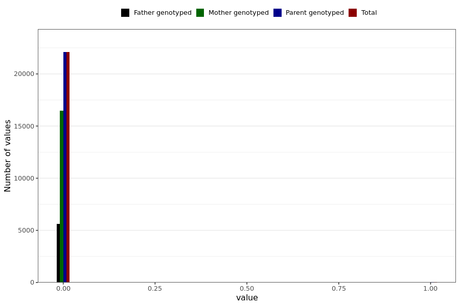

# corona_vaccine_myokardite_after_bnt
- Number of values:

| Value | Total | Child genotyped | Mother genotyped | Father genotyped | Parents genotyped |
| ----- | ----- | --------------- | ---------------- | ---------------- |---------------- |
| Missing | 208875 | 83470 | 71176 | 54229 | 125405 |
| Non-missing | 22114 | 0 | 16469 | 5645 | 22114 |

| Value | Total | Child genotyped | Mother genotyped | Father genotyped | Parents genotyped |
| ----- | ----- | --------------- | ---------------- | ---------------- |---------------- |
| 0 | 22087 | 0 | 16454 | 5633 | 22087 |
| 1 | 27 | 0 | 15 | 12 | 27 |

