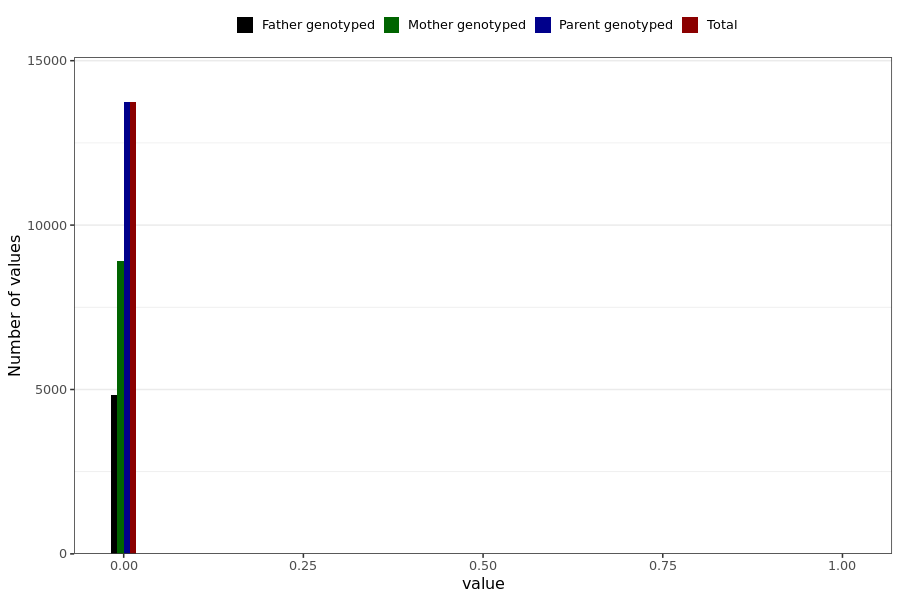

# corona_vaccine_myokardite_after_mod
- Number of values:

| Value | Total | Child genotyped | Mother genotyped | Father genotyped | Parents genotyped |
| ----- | ----- | --------------- | ---------------- | ---------------- |---------------- |
| Missing | 217245 | 83470 | 78730 | 55045 | 133775 |
| Non-missing | 13744 | 0 | 8915 | 4829 | 13744 |

| Value | Total | Child genotyped | Mother genotyped | Father genotyped | Parents genotyped |
| ----- | ----- | --------------- | ---------------- | ---------------- |---------------- |
| 0 | 13735 | 0 | 8912 | 4823 | 13735 |
| 1 | 9 | 0 | 3 | 6 | 9 |

