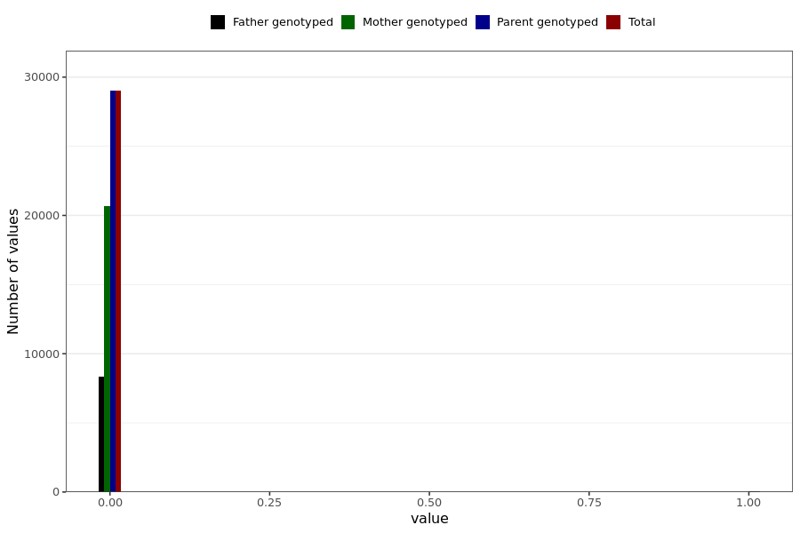

# corona_vaccine_myokardite_last_dose
- Number of values:

| Value | Total | Child genotyped | Mother genotyped | Father genotyped | Parents genotyped |
| ----- | ----- | --------------- | ---------------- | ---------------- |---------------- |
| Missing | 201959 | 83470 | 66944 | 51545 | 118489 |
| Non-missing | 29030 | 0 | 20701 | 8329 | 29030 |

| Value | Total | Child genotyped | Mother genotyped | Father genotyped | Parents genotyped |
| ----- | ----- | --------------- | ---------------- | ---------------- |---------------- |
| 0 | 29006 | 0 | 20691 | 8315 | 29006 |
| 1 | 24 | 0 | 10 | 14 | 24 |

