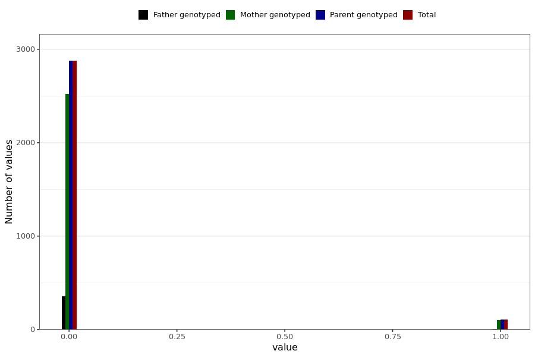

# corona_vaccine_nose_bleeding_after_asz
- Number of values:

| Value | Total | Child genotyped | Mother genotyped | Father genotyped | Parents genotyped |
| ----- | ----- | --------------- | ---------------- | ---------------- |---------------- |
| Missing | 228004 | 83470 | 85021 | 59513 | 144534 |
| Non-missing | 2985 | 0 | 2624 | 361 | 2985 |

| Value | Total | Child genotyped | Mother genotyped | Father genotyped | Parents genotyped |
| ----- | ----- | --------------- | ---------------- | ---------------- |---------------- |
| 0 | 2876 | 0 | 2523 | 353 | 2876 |
| 1 | 109 | 0 | 101 | 8 | 109 |

