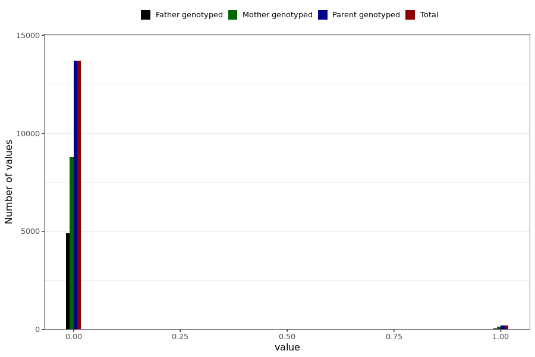

# corona_vaccine_nose_bleeding_after_mod
- Number of values:

| Value | Total | Child genotyped | Mother genotyped | Father genotyped | Parents genotyped |
| ----- | ----- | --------------- | ---------------- | ---------------- |---------------- |
| Missing | 217092 | 83470 | 78722 | 54900 | 133622 |
| Non-missing | 13897 | 0 | 8923 | 4974 | 13897 |

| Value | Total | Child genotyped | Mother genotyped | Father genotyped | Parents genotyped |
| ----- | ----- | --------------- | ---------------- | ---------------- |---------------- |
| 0 | 13694 | 0 | 8777 | 4917 | 13694 |
| 1 | 203 | 0 | 146 | 57 | 203 |

