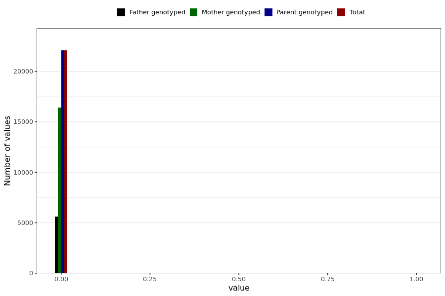

# corona_vaccine_perikardite_after_bnt
- Number of values:

| Value | Total | Child genotyped | Mother genotyped | Father genotyped | Parents genotyped |
| ----- | ----- | --------------- | ---------------- | ---------------- |---------------- |
| Missing | 208883 | 83470 | 71190 | 54223 | 125413 |
| Non-missing | 22106 | 0 | 16455 | 5651 | 22106 |

| Value | Total | Child genotyped | Mother genotyped | Father genotyped | Parents genotyped |
| ----- | ----- | --------------- | ---------------- | ---------------- |---------------- |
| 0 | 22072 | 0 | 16435 | 5637 | 22072 |
| 1 | 34 | 0 | 20 | 14 | 34 |

